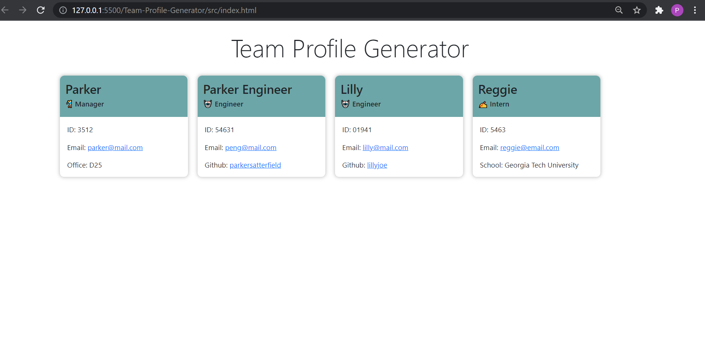
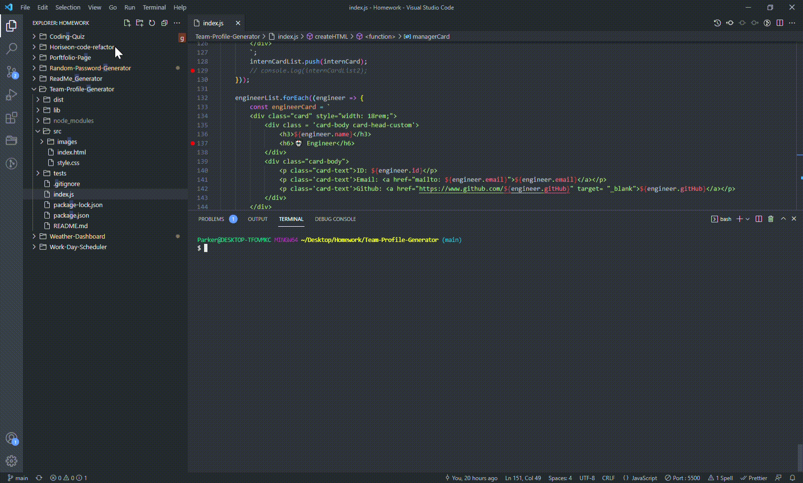

# **Team-Profile-Generator**

### *This app is a Team Profile Page Generator that takes user input from the command line and creates an index.html page with cards for each team member that a user inputs.* 

## [](https://opensource.org/licenses/Apache-2.0) 

## Mock Ups
### Result
  
### Input Video
  
### Test Video
  

Video Link: https://drive.google.com/file/d/1NyHIUgLEQw1jP4LcxKoTL0ZCU6VCnX8O/view?usp=sharing

## Table of Contents 

1. [Installation](#installation)

2. [Usage](#usage)

3. [Contributing](#contributing)

4. [Test](#test)

5. [Questions](#questions)

## Installation 

1. Download the app from my repo.
2. Run npm i to install all required packages (jest for testing, inquirer and inquirer-recursive for user input).
```
npm i
```
3. Run command 
```
node index.js
```

## Usage 

Use this app to generate an index.html page with cards for each team member. 

## Contributing 

Just myself on this one. 

## Test 

This application utilizes Jest for testing. Test files are located in the tests folder ( ./tests). Testing can be invoked using the command below.
```
npm run test
```

## Questions 

Email: parkers205@gmail.com 

GitHub: https://github.com/parkersatterfield 

---

## License Information 
APACHE 2.0 (Not really, I am just showing of my README generator app).

            